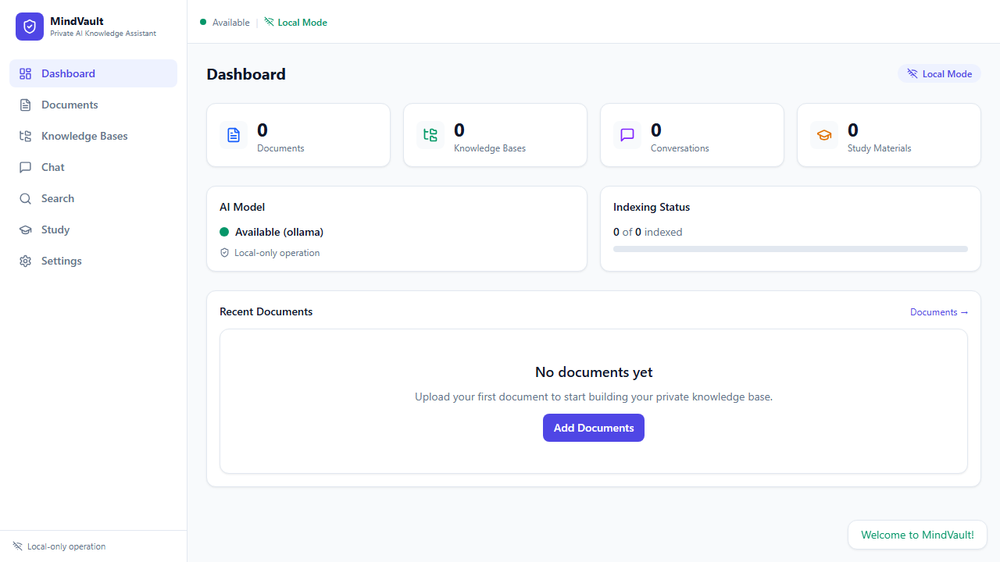
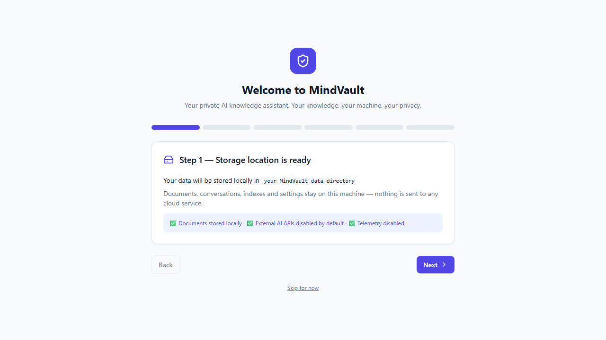
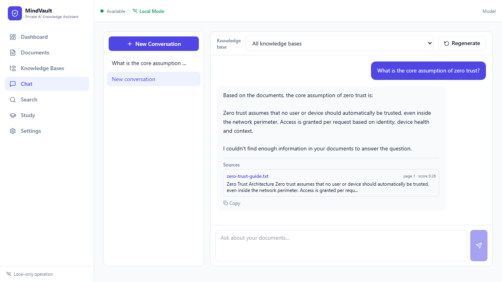
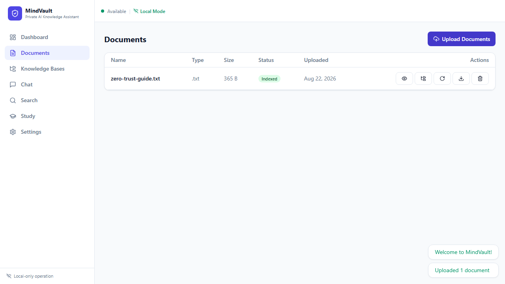
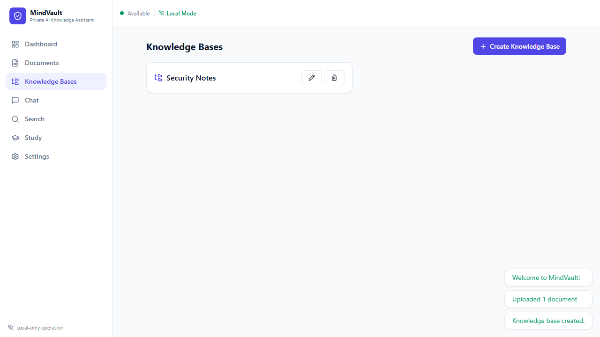
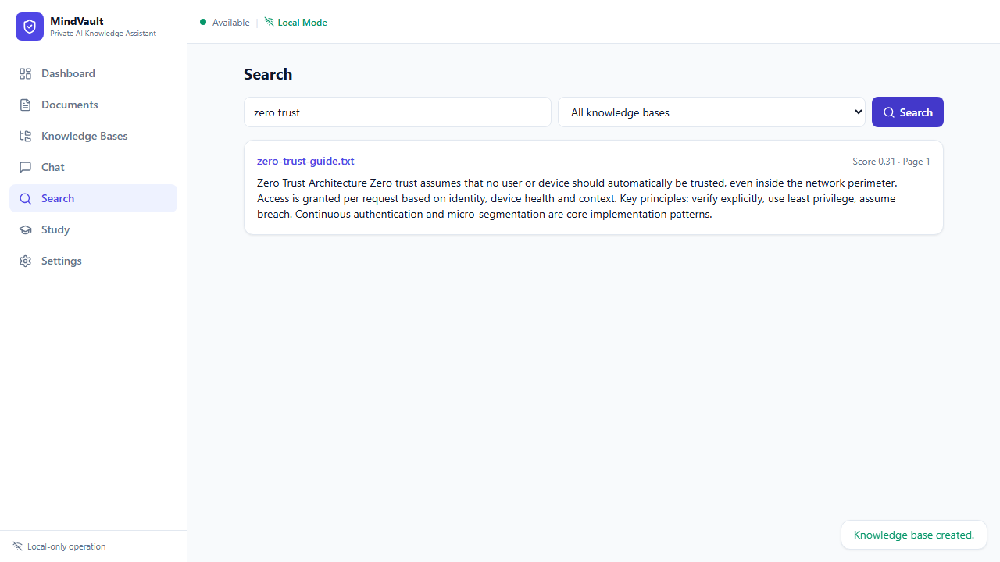
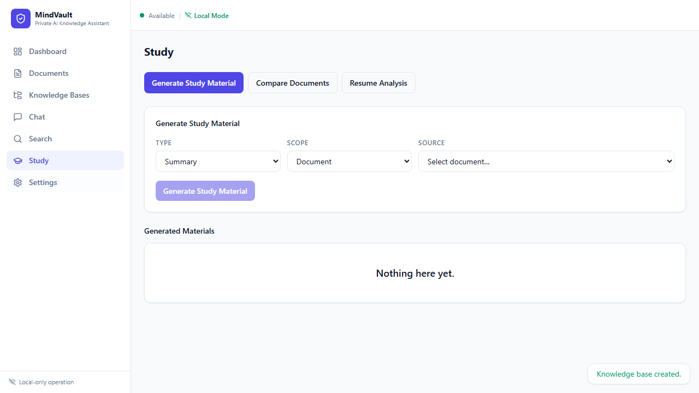
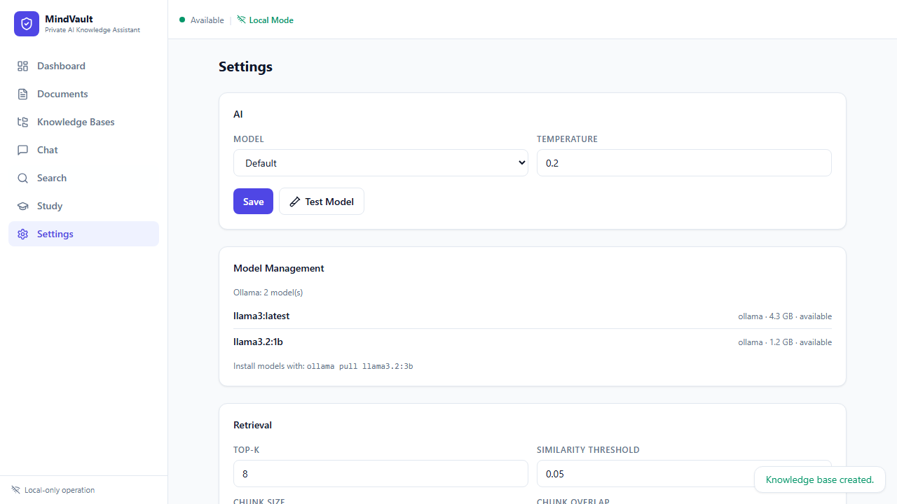

**Live demo:** https://mindvault-l60k.onrender.com — full app (UI + API) with a cloud LLM backend; data is ephemeral on the free tier.

# MindVault

> **Private AI Knowledge Assistant — Your knowledge, your machine, your privacy.**

MindVault is a **local-first** AI knowledge assistant. You upload your documents, organize them into knowledge bases, search them semantically, and ask questions — all processed on your own machine by local AI models. **No OpenAI, no Gemini, no cloud, no account, no telemetry.**



---

## Why MindVault?

| | MindVault | Typical AI "assistant" |
|---|---|---|
| Documents stored | **On your machine** | On a vendor's servers |
| Conversations stored | **On your machine** | On a vendor's servers |
| AI inference | **Local (Ollama / llama.cpp)** | Vendor API |
| Works offline | **Yes** (after models installed) | No |
| Account required | **No** | Usually |
| Telemetry | **Disabled by default** | Often on by default |

---

## Features

- **Documents** — drag & drop upload of **PDF, DOCX, TXT, Markdown, CSV, JSON** with validation, progress, retry and duplicate detection (content hashing).
- **Knowledge bases** — organize documents into named collections and search / chat within them.
- **Semantic search** — find relevant passages even when the exact phrase is absent, with knowledge-base, document and file-type filters.
- **RAG chat with citations** — every answer is grounded in your documents and shows clickable **sources** (filename + page/section).
- **Anti-hallucination** — a hardened prompt treats document text as *data, not instructions*, refuses to invent citations, and says *"I couldn't find enough information in your documents."* when evidence is thin.
- **Study mode** — generate summaries, flashcards, MCQs, short-answer and interview questions, concepts and revision notes from your documents using the local model.
- **Document comparison** — select two or more documents and get similarities, differences, and missing concepts.
- **Resume Compatibility Analysis** — optional tool that compares a resume against a job description (skills, gaps, suggestions; explicitly not an official ATS score).
- **Prompt-injection defense** — uploaded documents can never override system instructions or execute commands.
- **Full local privacy** — no analytics, no tracking, no external AI requests, no cloud storage.
- **Conversations** — new, rename, delete, regenerate, copy, stop generation, streaming responses.
- **Model management** — detect installed Ollama models, test them, and switch providers from Settings.
- **Data ownership** — export conversations and knowledge bases as JSON; delete individual items or everything.

---

## Screenshots

| First run | Dashboard | Chat with sources |
|---|---|---|
|  |  |  |

| Documents | Knowledge Bases | Search |
|---|---|---|
|  |  |  |

| Study | Settings |
|---|---|
|  |  |

---

## Architecture (summary)

```
React + TypeScript frontend
        ↓ REST API
FastAPI backend (local, async)
        ↓
Application services (documents, chat, search, study, …)
        ↓
Domain logic (chunking, RAG pipeline, prompts)
        ↓
Infrastructure
├── SQLite (SQLAlchemy + Alembic migrations)
├── Vector store (FAISS, NumPy fallback)
├── Document parsers (PDF, DOCX, TXT, MD, CSV, JSON)
├── Embedding provider (sentence-transformers | hash fallback)
└── LLM provider (Ollama | llama.cpp | mock)
```

Providers are swappable interfaces — new parsers, embedding backends or LLM
backends can be added without touching the rest of the application.

Full details: [docs/architecture.md](docs/architecture.md).

---

## Privacy model

By default MindVault is **fully local**:

- documents are stored under your data directory (default `~/.mindvault`)
- conversations are stored in the local SQLite database
- AI inference runs against your local Ollama or llama.cpp server
- no analytics, no telemetry, no tracking
- external AI APIs are **disabled by default** and would be strictly opt-in in any future version
- telemetry is **disabled by default**

See [docs/security-threat-model.md](docs/security-threat-model.md) and
[docs/privacy.md](docs/privacy.md).

---

## Installation

### End-user (Windows / Linux / macOS)

1. Download the MindVault package for your platform from the Releases page.
2. Install and launch.
3. On first run, follow the guided setup:
   - choose where your data lives,
   - check your system,
   - choose a local model (Ollama recommended),
   - test the model,
   - upload your first document,
   - ask your first question.

> Model weights are **not** bundled with MindVault. You install them through
> your chosen local model runtime (e.g. `ollama pull llama3.2:3b`).

### Docker

```bash
docker compose up --build -d
# open http://localhost:8000
```

This starts MindVault together with a local Ollama sidecar. See
[docs/deployment.md](docs/deployment.md).

### From source (developers)

```bash
git clone https://github.com/your-org/mindvault.git
cd mindvault

# Backend
cd backend
python -m venv .venv
# Windows: .venv\Scripts\activate | Linux/macOS: source .venv/bin/activate
pip install -e ".[dev]"           # add [ml] for semantic embeddings + FAISS
# optional: pip install -e ".[ml]"
cp .env.example .env
uvicorn mindvault.api.app:create_app --factory --reload

# Frontend (second terminal)
cd ../frontend
npm install
npm run dev
# open http://localhost:5173
```

See [docs/development.md](docs/development.md) for details.

---

## Local model setup

### Ollama (recommended, cross-platform)

1. Install [Ollama](https://ollama.com/download).
2. Pull a model: `ollama pull llama3.2:3b` (small) or `llama3.1:8b` (medium).
3. Keep Ollama running; MindVault connects to `http://127.0.0.1:11434`.
4. In MindVault *Settings → AI*, pick the model and click **Test Model**.

### llama.cpp

1. Build or download `llama-server` for your platform.
2. Run: `llama-server -m model.gguf --host 127.0.0.1`
3. MindVault auto-detects the OpenAI-compatible endpoint.

### Embeddings

- Default (no download): deterministic **hash** embeddings — works everywhere, offline, zero dependencies.
- Better quality: install `mindvault[ml]` and set `MV_EMBEDDING_PROVIDER=sentence-transformers` — the model downloads once and is cached locally.

Model recommendations by hardware are in [docs/models.md](docs/models.md).

---

## Development

```bash
# Backend checks
cd backend
ruff check mindvault tests
mypy mindvault/domain mindvault/parsers mindvault/embeddings mindvault/vectorstore mindvault/llm mindvault/security mindvault/jobs --follow-imports=skip
MV_EMBEDDING_PROVIDER=hash MV_LLM_PROVIDER=mock pytest tests
MV_EMBEDDING_PROVIDER=hash MV_LLM_PROVIDER=mock pytest tests/eval

# Frontend checks
cd frontend
npx tsc --noEmit
npm run test
npm run build

# E2E (needs backend + built frontend running)
npx playwright install chromium
npx playwright test
```

---

## Security

MindVault treats uploaded documents as **untrusted input**. It defends against:

- path traversal & arbitrary file access,
- malicious filenames, oversized uploads, malformed files,
- prompt injection from document content,
- command injection (no model can execute shell commands),
- SQL injection (parameterized ORM queries),
- XSS in the web UI (React escaping, no `dangerouslySetInnerHTML`),
- dependency vulnerabilities (Dependabot + pip/npm audit in CI).

See [SECURITY.md](SECURITY.md) and
[docs/security-threat-model.md](docs/security-threat-model.md).

---

## License

MindVault is licensed under the **AGPL-3.0-only** license.

**Why AGPL?** MindVault is free and open source. AGPL-3.0 keeps it free for
everyone — including anyone who runs it as a network service — while
protecting the contributors' rights. If you fork MindVault and offer it over a
network, you must share your changes under the same license.

MindVault does **not** redistribute any model weights. Model licenses belong
to their respective owners — see [THIRD_PARTY_LICENSES.md](THIRD_PARTY_LICENSES.md).

---

## Roadmap

- **v1 (this release):** documents, knowledge bases, semantic search, local
  LLM, RAG + citations, chat, study mode, settings, SQLite, Docker, tests, CI,
  security protections, documentation.
- **v2:** OCR & scanned-PDF support, image understanding, PPTX/XLSX, code
  search, voice input/output, hybrid search, advanced reranking.
- **v3 (opt-in only):** encrypted cloud sync, team collaboration, remote
  inference — all disabled by default and never required.

---

## Contributing

See [CONTRIBUTING.md](CONTRIBUTING.md) and
[CODE_OF_CONDUCT.md](CODE_OF_CONDUCT.md).

## Security disclosures

See [SECURITY.md](SECURITY.md).

## Changelog

See [CHANGELOG.md](CHANGELOG.md).
